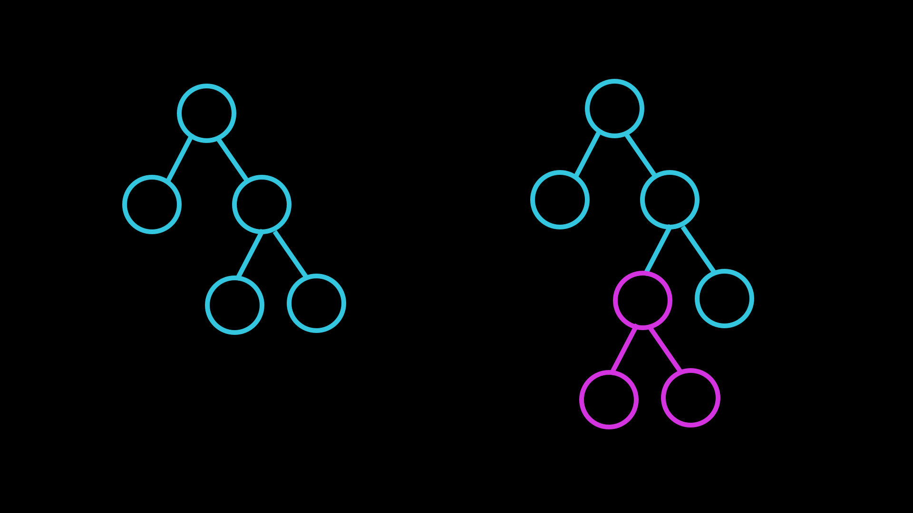
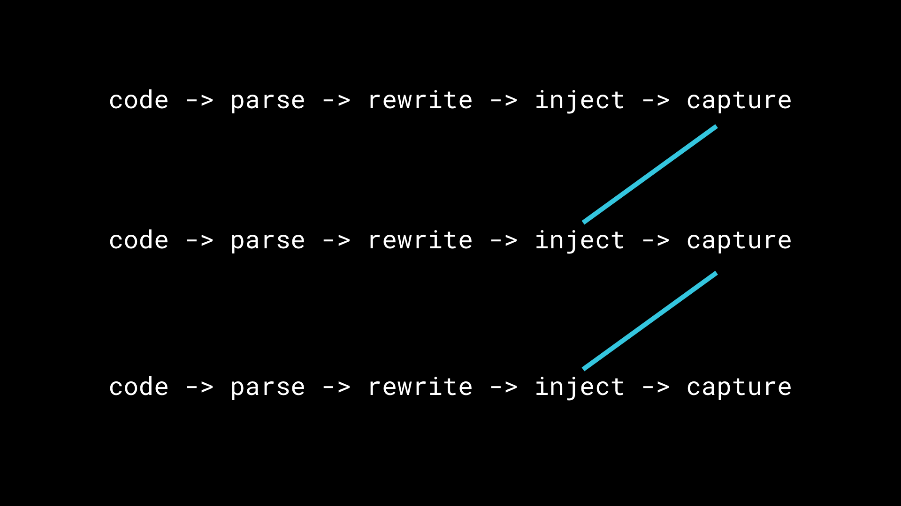

# Making
# a lot
# of things

---

# I'm Ben

* 2017
* 2016
* 2015
* …

---

* indyref
* brexit
* terrorism

---

##  The world is a bit shit
### our community is more important than ever

---

#[fit] :heart: codegram :heart:

---

# …

---

# What I want tech to feel like

---

#[fit] [Compact cassette tape]

---

# [1963]
## [tape recorder]

---

## [zx spectrum]
### [flexibility]

^ Repurposeable

---

# […]
## [tape adaptor]

^ Future Friendly?

---

# [90 minutes]
## constraint

---

# a unit of creativity

---

the button

---

dither

---

cubes

---

cursory-hack

---

split-scan

---

cardboctober

---

webgl-hacks

---

audio-stereograph

---

<!-- What I've gained:

* satisfaction
* knowledge

--- -->

Key stuff:

<!-- * lower barrier to creation -->
* exploration
* constraint

---


---

My freedom thus consists in my moving about within the narrow frame that I have assigned to myself for each one of my undertakings. I shall go even further: my freedom will be so much the greater and more meaningful the more narrowly I limit my field of action and the more I surround myself with obstacles. Whatever diminishes constraint diminishes strength. The more constraints one imposes, the more one frees oneself of the claims that shackle the spirit.

> Igor Stravinsky

---

# Constraint breeds creativity

---

### Today:

## 1. Coding
## 2. Publishing

---

# 1. Coding

---

# Things can get quite complex

[html listing]
[webpack deps]
[build systems]

---

# Sandboxes

[babel]
[svelte]
[esprima]
[…]
[http://www.tryclj.com/]

^ As a way of getting round this, and letting people explore, straight into the depth of the complexity

---
<!--
# Interactive coding

[jsbin]
[jsfiddle]
[…]

--- -->

# Interactive REPLs

^ By interactive, I mean that you don't have to press enter

<!--
---

## explorative ?

# ↵

### ⨉

---

## output

# …

### ⨉

^
The output of these repls are pretty much text, which is great but we could do better -->

---

# Let's build one

---

```html
<textarea></textarea>
<iframe sandbox="allow-scripts"></iframe>
```

---

### 1. Inject script into an iframe

```
const value = ${your_code};

print(value)
```

---

### 2. Multiple expressions


```js
const ten = () => {

}

Array.from({length: 500}, ten).join('')
```

---

### rewriting code

esprima
recast
ast-types

ast-explorer

(maybe don't mention these till later)

^ JavaScript isn't text
JavaScript is a subset of text

---

[ast]


---



---

code -> rewrite -> inject

---

[interactive cell demo]

---

## Adding more cells

---

[jupyter]
[maple]
[matlab]
[runkit]
[literate JavaScript]

---



---
